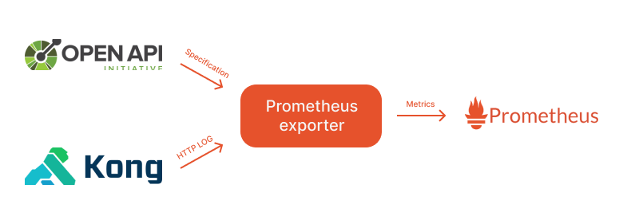

# Kong OpenAPI 3.0 prometheus exporter

This exporter takes an OpenAPI 3.0 specification and a kong http request log to generate prometheus metrics, grouping metrics by specific path, method, status code, duration and optionally operation ID and selected headers.

<p align="center">
    
</p>

## Setup guide

### 1. Deploy the exporter

-   Download the kubernetes manifest from [deployment/k8s.yaml](deployment/k8s.yaml).
-   Change the `openapi.url` and other configuration values as needed in the ConfigMap.
    -   Alternatively, you can mount the OpenAPI 3.0 specification file to container using a volume and set the `openapi.file` configuration.
-   Deploy the exporter to your kubernetes cluster.

### 2. Add global kong HTTP log plugin

Next you need to add a global kong HTTP log plugin to the kong gateway. This plugin will log all requests to the exporter.

```yaml
apiVersion: configuration.konghq.com/v1
kind: KongClusterPlugin
metadata:
    name: kong-openapi-prometheus-exporter-http-log
    annotations:
        kubernetes.io/ingress.class: kong
    labels:
        global: "true"
config:
    http_endpoint: http://logs.kong-openapi-prometheus-exporter.svc.cluster.local:8080
    method: POST
    timeout: 1000
    keepalive: 1000
    retry_count: 1
plugin: http-log
```

## Configuration

| **Variable**                   | **Default Value** | **Description**                                                                  |
| ------------------------------ | ----------------- | -------------------------------------------------------------------------------- |
| `log.level`                    | `info`            | The level of logging detail. Common values are `debug`, `info`, `warn`, `error`. |
| `log.format`                   | `json`            | The format of the log output. Common formats are `text` and `json`.              |
| `prometheus.path`              | `/metrics`        | The URL path where metrics are exposed.                                          |
| `prometheus.port`              | `9090`            | The port on which the Prometheus metrics endpoint listens.                       |
| `openapi.url`                  |                   | The URL of the OpenAPI 3.0 specification.                                        |
| `openapi.file`                 |                   | The path to the OpenAPI 3.0 specification file.                                  |
| `openapi.reload`               | `6h`              | The interval at which the OpenAPI 3.0 documentation is reloaded.                 |
| `metrics.headers`              | `[]`              | List of HTTP headers to be included in the metrics.                              |

**Warning**:

Including headers in the metrics can lead to a high cardinality of metrics, which can lead to performance issues in Prometheus. Use this feature with caution.

Don't include sensitive information in the headers, as they will be exposed in the metrics.
